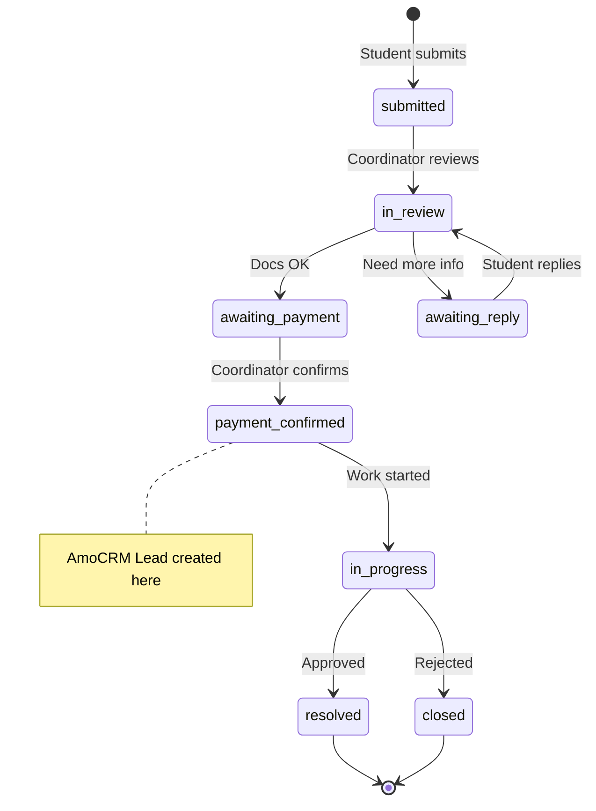

# Database Schema

## How to View

### dbdiagram.io (recommended)
1. Open [dbdiagram.io](https://dbdiagram.io)
2. Copy the DBML code below
3. Paste into the editor → interactive visual schema

### GitHub
Push to GitHub — Mermaid diagrams render automatically in markdown.

### VS Code
Extension: "Markdown Preview Mermaid Support"

---

## DBML — Copy & Paste into [dbdiagram.io](https://dbdiagram.io)

```dbml
// =============================================
// HOMOLOGATION APP — Database Schema
// Paste at https://dbdiagram.io
// =============================================

// ─────────────────────────────────────────────
// AUTH & USERS
// ─────────────────────────────────────────────

Table users [headercolor: #3498db] {
  id integer [pk, increment]
  name varchar [not null, note: 'Full name']
  email_address varchar [not null, unique, note: 'Login email']
  password_digest varchar [note: 'NULL if OAuth-only']
  provider varchar [note: 'google / apple']
  uid varchar [note: 'OAuth provider ID']
  avatar_url varchar
  phone varchar [note: '🔒 encrypted']
  whatsapp varchar [not null, note: '🔒 encrypted, for AmoCRM']
  birthday date
  country varchar
  locale varchar [default: 'es', note: 'es / en / ru']
  amo_crm_contact_id varchar
  privacy_accepted_at datetime [note: 'GDPR consent']
  created_at datetime [not null]
  updated_at datetime [not null]

  indexes {
    email_address [unique, name: 'idx_users_email']
    (provider, uid) [unique, name: 'idx_users_oauth']
  }
}

Table roles [headercolor: #3498db] {
  id integer [pk, increment]
  name varchar [not null, unique, note: 'super_admin / coordinator / teacher / student / family']
}

Table user_roles [headercolor: #3498db] {
  id integer [pk, increment]
  user_id integer [not null]
  role_id integer [not null]

  indexes {
    (user_id, role_id) [unique]
  }
}

Table sessions [headercolor: #3498db] {
  id integer [pk, increment]
  user_id integer [not null]
  ip_address varchar
  user_agent varchar
  created_at datetime [not null]
  updated_at datetime [not null]

  Note: 'Rails 8 built-in auth sessions'
}

// ─────────────────────────────────────────────
// HOMOLOGATION REQUESTS (core business)
// ─────────────────────────────────────────────

Table homologation_requests [headercolor: #e74c3c] {
  id integer [pk, increment]
  user_id integer [not null, note: '→ student']
  coordinator_id integer [note: '→ assigned coordinator']

  // ── Student fills ──
  service_type varchar [not null, note: 'equivalencia / invoice / informe / other']
  subject varchar [not null]
  description text
  identity_card varchar [note: '🔒 encrypted']
  passport varchar [note: '🔒 encrypted']
  education_system varchar [note: 'Country/system']
  studies_finished varchar [note: 'yes / no / in_progress']
  study_type_spain varchar [note: 'grado / master / doctorado / fp / bachillerato']
  studies_spain varchar
  university varchar
  country varchar [note: 'Pre-filled from profile']
  referral_source varchar
  language_knowledge varchar [note: 'A1–C2']
  language_certificate varchar [note: 'DELE / SIELE']
  privacy_accepted boolean [not null, default: false]

  // ── Coordinator / System ──
  status varchar [not null, default: 'submitted', note: 'See status flow ⬇']
  payment_amount decimal [note: '€, coordinator sets']
  payment_confirmed_at datetime
  payment_confirmed_by integer [note: '→ coordinator']
  amo_crm_lead_id varchar
  amo_crm_synced_at datetime
  amo_crm_sync_error text
  created_at datetime [not null]
  updated_at datetime [not null]

  indexes {
    user_id [name: 'idx_requests_user']
    coordinator_id [name: 'idx_requests_coordinator']
    status [name: 'idx_requests_status']
    amo_crm_lead_id [name: 'idx_requests_crm']
  }

  Note: '''
  📎 Active Storage:
    • application  (one file)  — заявление
    • originals    (many files) — оригиналы
    • documents    (many files) — прочие

  📊 Status flow:
    submitted → in_review → awaiting_payment
    → payment_confirmed ⚡ AmoCRM Lead created
    → in_progress → resolved / closed
  '''
}

// ─────────────────────────────────────────────
// CHAT
// ─────────────────────────────────────────────

Table conversations [headercolor: #2ecc71] {
  id integer [pk, increment]
  homologation_request_id integer [not null, unique]
  created_at datetime [not null]
  updated_at datetime [not null]

  Note: 'Auto-created with each request. One conversation per request.'
}

Table messages [headercolor: #2ecc71] {
  id integer [pk, increment]
  conversation_id integer [not null]
  user_id integer [not null, note: 'Author']
  body text [not null]
  created_at datetime [not null]
  updated_at datetime [not null]

  indexes {
    conversation_id
    (conversation_id, created_at)
  }

  Note: '''
  📎 has_many_attached :attachments
  📡 Broadcast via Action Cable on create
  '''
}

// ─────────────────────────────────────────────
// NOTIFICATIONS
// ─────────────────────────────────────────────

Table notifications [headercolor: #f39c12] {
  id integer [pk, increment]
  user_id integer [not null, note: 'Recipient']
  notifiable_type varchar [not null, note: 'Request / Message']
  notifiable_id integer [not null]
  title varchar [not null]
  body text
  read_at datetime [note: 'NULL = unread']
  created_at datetime [not null]
  updated_at datetime [not null]

  indexes {
    user_id
    (notifiable_type, notifiable_id)
    (user_id, read_at)
  }
}

// ─────────────────────────────────────────────
// AMOCRM
// ─────────────────────────────────────────────

Table amo_crm_tokens [headercolor: #9b59b6] {
  id integer [pk, increment]
  access_token text [not null]
  refresh_token text [not null]
  expires_at datetime [not null]
  created_at datetime [not null]
  updated_at datetime [not null]

  Note: 'Single row. Auto-refreshed by AmoCrmClient service.'
}

// ─────────────────────────────────────────────
// ACTIVE STORAGE (auto-created by Rails)
// ─────────────────────────────────────────────

Table active_storage_blobs [headercolor: #95a5a6] {
  id integer [pk]
  key varchar [not null, unique]
  filename varchar [not null]
  content_type varchar
  byte_size bigint [not null]
  checksum varchar
  service_name varchar [not null]
  created_at datetime [not null]

  Note: 'Stores file metadata. Actual files on disk or S3.'
}

Table active_storage_attachments [headercolor: #95a5a6] {
  id integer [pk]
  name varchar [not null, note: 'application / originals / documents / attachments']
  record_type varchar [not null, note: 'HomologationRequest / Message']
  record_id integer [not null]
  blob_id integer [not null]
  created_at datetime [not null]

  Note: 'Polymorphic join table: links blobs to models.'
}

// =============================================
// RELATIONSHIPS
// =============================================

// Auth
Ref: user_roles.user_id > users.id
Ref: user_roles.role_id > roles.id
Ref: sessions.user_id > users.id

// Requests
Ref: homologation_requests.user_id > users.id
Ref: homologation_requests.coordinator_id > users.id
Ref: homologation_requests.payment_confirmed_by > users.id

// Chat
Ref: conversations.homologation_request_id - homologation_requests.id
Ref: messages.conversation_id > conversations.id
Ref: messages.user_id > users.id

// Notifications
Ref: notifications.user_id > users.id

// Active Storage
Ref: active_storage_attachments.blob_id > active_storage_blobs.id

// =============================================
// TABLE GROUPS
// =============================================

TableGroup "🔐 Auth & Users" [color: #3498db] {
  users
  roles
  user_roles
  sessions
}

TableGroup "📋 Homologation" [color: #e74c3c] {
  homologation_requests
}

TableGroup "💬 Chat" [color: #2ecc71] {
  conversations
  messages
}

TableGroup "🔔 Notifications" [color: #f39c12] {
  notifications
}

TableGroup "🔗 AmoCRM" [color: #9b59b6] {
  amo_crm_tokens
}

TableGroup "📎 Files (Rails)" [color: #95a5a6] {
  active_storage_blobs
  active_storage_attachments
}
```

---

## Status Flow



---

## Quick Reference

### Encrypted Fields (GDPR)
| Model | Field | Reason |
|---|---|---|
| User | `phone`, `whatsapp` | Personal data |
| Request | `identity_card`, `passport` | Document numbers |

### File Attachments (Active Storage)
| Model | Name | Type | Max size |
|---|---|---|---|
| Request | `application` | has_one_attached | 10 MB |
| Request | `originals` | has_many_attached | 10 MB each |
| Request | `documents` | has_many_attached | 10 MB each |
| Message | `attachments` | has_many_attached | 5 MB each |

### Seeds
```ruby
%w[super_admin coordinator teacher student family].each { |r| Role.find_or_create_by!(name: r) }
```
